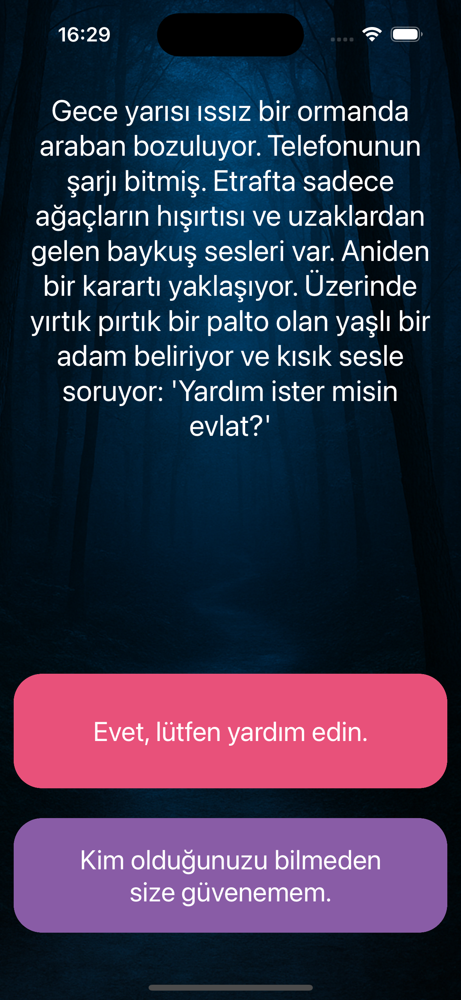
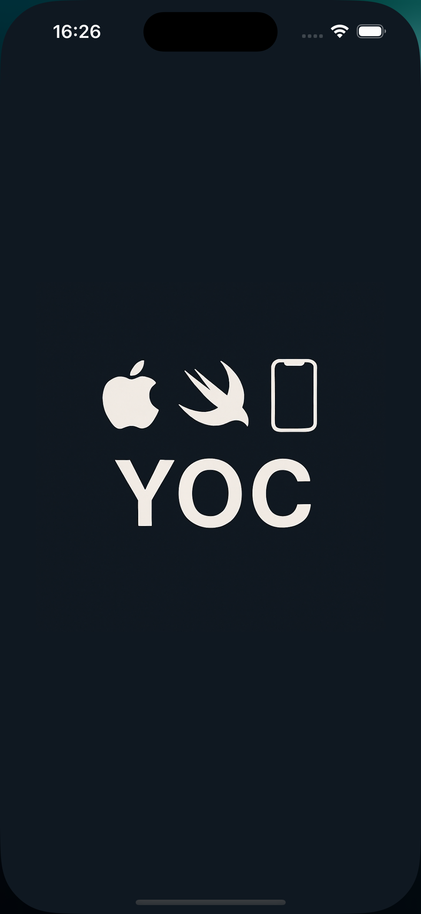
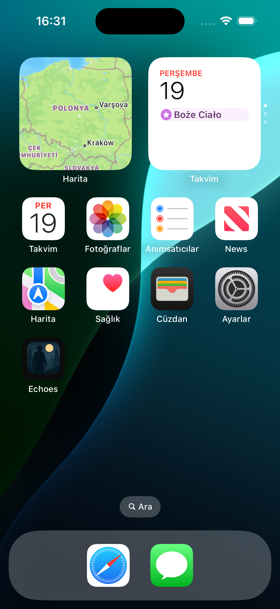

# Echoes

🎮 **Echoes** — A choice-driven horror experience on iOS.  
Your car breaks down in a dark, silent forest. A shadow approaches… What will you do?

## 🖼️ Screenshots

### Main Screen



### 🔵 Splash Screen


### 🧙‍♀️ App Icon


## 🕹️ About the Game

Echoes is a narrative-based horror game built with **Swift** and **SwiftUI**.  
The story evolves based on the decisions the player makes. With every choice, you shape your own fate in a chilling, immersive world.

## 📖 Gameplay

You find yourself stranded in a desolate forest at midnight, with no phone signal and no way out. Suddenly, a mysterious figure appears.

Will you:
- 🤝 Trust the stranger?
- ❌ Reject help and risk it alone?

> Each choice leads to different story branches and endings.

## 📱 Platform

- iOS 15+
- Compatible with iPhone (iPad support planned)

## 🔧 Technologies Used

- Swift
- SwiftUI
- Xcode
- Story-driven architecture
- Custom UI components for interactive storytelling

## 🚀 Getting Started

1. Clone the repository:
   ```bash
   git clone https://github.com/Yoc0603/echoes.git
   
## Author

**Yavuz** – iOS Developer
